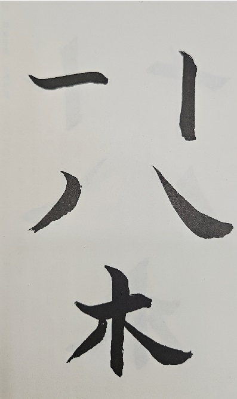
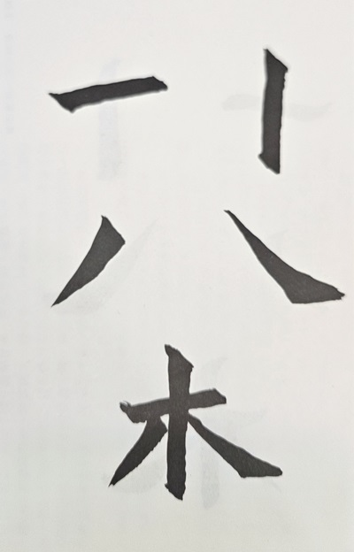
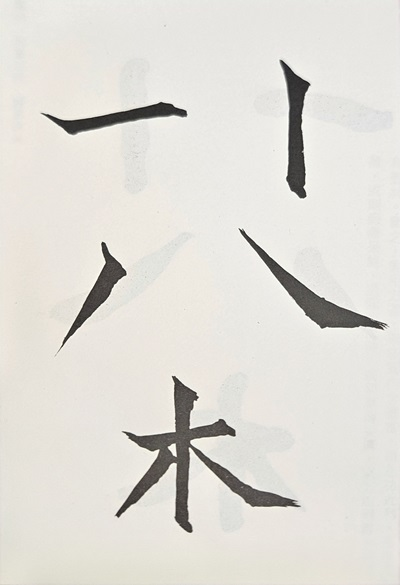
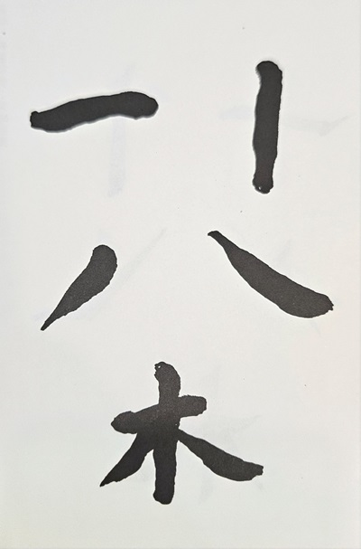

---
title: '佚名-張猛龍碑'
tags: ['碑刻', '楷書']
order: 6
---
# 佚名-張猛龍碑

## 特色
* 方正雄強，結體穩重。
* 行筆遲澀而深沉，得舒緩、藏露對立統一之妙。
* 同樣的部首邊龍變化多端，和而不同。

## 書寫要領
* 可先從《龍門二十品》中擇優臨習魏碑的穩重行筆和結體，再來臨習此帖。
* 此碑石因日久剝飾，其筆劃線條較原本纖瘦，因此臨習時可令筆畫稍加粗壯。
* 四要
  * 含墨要飽，字才能夠豐腴厚重
  * 緊筆入紙，線質才能沈雄中實
  * 行筆稍慢，務求溺筆逆勢節前
  * 方中寓圓，起收筆和轉折處用方筆（側鋒），而運行時應用圓筆（中鋒），方圓不斷交替，關鋌在於手腕轉動靈活。
* 三忌
  * 忌側鋒偏鋒不分
  
    側鋒：執筆緊挺，筆鋒略斜而摩擦入紙運行，讓筆畫線條勁挺有力。      
    偏鋒：執筆髮懈，而令筆肚揩抹紙面運行，筆畫軟緩扁薄。          
    ::: warning 病筆示意-偏鋒扁軟
    
    :::
  * 忌方板平直
  
    寫魏碑者如果只用側鋒，而全無中鋒方圓之意，讓筆畫毫無起伏波折，而顯得平直板滯。    
    ::: warning 病筆示意-方板平直:
    
    :::
  * 忌太厲太鈍
    
    用筆如太厲太尖，字會顯得缺乏沈厚。
    ::: warning 病筆示意-尖峭刻厲:
    
    :::
    
    用筆圓鈍痴腫，字會顯得笨拙乏神。
    ::: warning 病筆示意-臃腫痴鈍:
    
    :::
* 結體注意事項
  * 收中放外：中宮收緊而四邊開張伸展。
  * 欹側奇險：反傳統的橫平堅直的靜態平行，而是大膽追求字勢傾斜，再傾斜中造而破險，讓筆畫間呈動態平行。
  * 奇正相生：字之部件構成通常會以中軸對正作均勻處理，但此碑常把相沿位置作了移動或伸縮，產生不正之正的奇趣。
    * 左右兩邊的字，不採對等開張，而是有意識的伸展一方，與另一方收歛成對比，則姿態自然橫生。
    * 左右兩邊的字，切忌同等高矮大小，可由挪移位置，產生高低不一的疏密變化。
  * 重心靠下：加上略呈方扁的字形，可得穩重平穩的效果。
  * 密者疏之：在字的最密之處特意省略或縮短筆畫，可讓字中透氣而不顯厚滯。
  * 粗幼對比：此碑的線條分佈上，時出粗筆和幼筆夾雜，引起強烈對比的視覺效果。
  
## 原文
君諱猛龍，字神囧，南陽白水人也。其氏族分興，源流所出，故已備詳，世錄不復具載。□□□□盛，蓊郁於帝皇之始，德星□□曜像于朱鳥之間；淵玄萬壑之中；巉岩千峰之上。弈葉清高，煥乎篇牘矣。周宣時。□□張仲。詩人詠其孝友。光緝姬氏。中興是賴。晉大夫張老，《春秋》嘉其聲績。漢初趙景王張耳，浮沉秦漢之間，終跨列士之賞。才（擢）幹世□君其後也！

魏明帝景初中西中郎將、使持節、平西將軍、涼州刺史瑍之十世孫。八世祖軌帝永興中使持節、安西將軍、護羌校尉、涼州刺史、西平公。七世祖素。軌（䡄）之第三子；晉明帝太寧中臨羌都尉、平西將軍、西海晉昌金城武威四郡太守。遂家武威。高祖鐘，信涼州武宣王大沮渠時，建威將軍、武威太守。曾祖章，偽涼舉秀才，本州治中從事史，西海樂都二郡太守。還朝尚書祠部郎、羽林監。祖興宗，偽涼都營護軍、建節將軍、饒河黃河二郡太守。父生樂，□□□□□□□□□□□□□歸國。青衿之志，白首方堅。

君體稟河靈，神資嶽（甚）秀，桂質蘭儀。點弱露以懷芳；松心□節，□□□□□□□□□成。自（目）□□朗，若新蘅之當春，初荷之出水。入孝出第，邦閭有名。雖黃金未應，無慚郭氏友朋。□□交遊□□□□超遙蒙箏人表，年廿七，遭父憂。寢食過禮，泣血情深。假使曾、柴更世，寧異今德？既傾乾覆，唯恃坤慈。冬溫夏凊，曉夕承奉。家貧致養，不辭采運之懃（勤）。年卅九，丁母艱。勺飲不入，偷魂七朝。磬力盡思，備之生死。脫時當宣尼無愧。深歎每事過人。孤風獨起，令譽日新，聲馳天紫。以延昌中出身，除奉朝請，優遊文省；朋儕慕其雅尚。朝廷以君蔭望如此，德□宣暢。以熙平之年除魯郡太守。治民以禮，移風以樂；如傷之痛，無怠於夙宵；若子之愛，有懷於心目。是使學校克（剋）修，比屋清業。農棄（桑）勸課，田織以登。入璄（境）觀朝，莫不禮讓。化感無心，草石如（知）變。恩及泉水（木），禽魚自安。勝殘不待；賒年有成。期月而已。遂令講習之音，再聲于闕裡；來蘇之歌，複詠於洙（誅）中。京兆五守。無以剋（克）加；河南二尹，裁可若茲。雖名位未上，風□□□且易俗之□。黃侯不足比功。宵魚之感，密子寧獨稱德？至乃辭金、退玉之貞耿、撥葵去織之信義，方之我君，今猶古也！《詩》雲：“愷悌君子，民之父母。”實恐韶曦遷影，東風改吹，盡地民庶，逆深泫慕。是以，刊石題詠，以旌盛美。誠文能式，  闡鴻□庶，揚烋烈□。其辭曰：

氏煥天文，體承帝胤。神秀春方，靈源在震。積石千尋，長松萬刃。軒冕周漢，冠蓋魏晉。河靈嶽秀，月起景飛。窮神開照，式誕英徽。高山仰止，從善如歸。唯德是蹈，唯仁是依。棲遲下庭，素心若雪。鸖（鶴）響難留，清音遐發。天心乃眷，觀光玉闕。浣紱紫河，承華煙月。妙簡唯□，剖符儒鄉。分金沂道，裂錦鄒方。春明好養，溫而□霜。乃如之人，寔（實）國之良。禮樂□□□□□□□□恤，小大以情，洗濯此群。雲褰天淨，千里開明。學建禮修（備），風教反正。野畔讓耕。林中□□□□□□□□□□中衣可改，留我明聖。何以勿剪，恩深在民。何以鳧憘，風化移新。飲河止滿，度海迷津。勒石圖□，永□□□□。

蕩寇將軍，魯郡丞北平□□□。參軍事廣平宋撫民。義主驤府騎兵參軍驤威府長史征魯府治城軍主□軍□。義主本郡二政主簿□□□。義主顏路。義主離狐令宋承憘。汾陽縣義主南城令嚴孝武。義主□賢文。

陽平縣義主、州主簿王盆生。
造頌四年正光三年正月廿三日訖。

