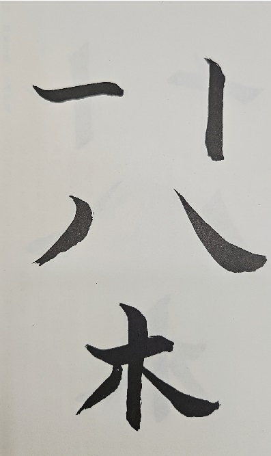
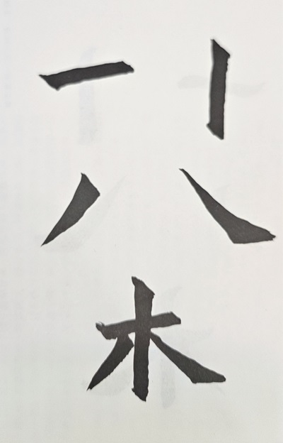
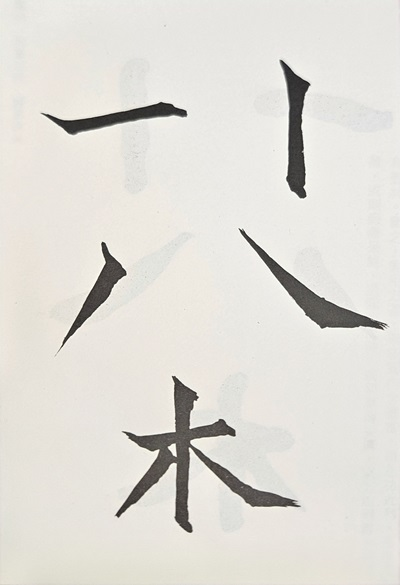
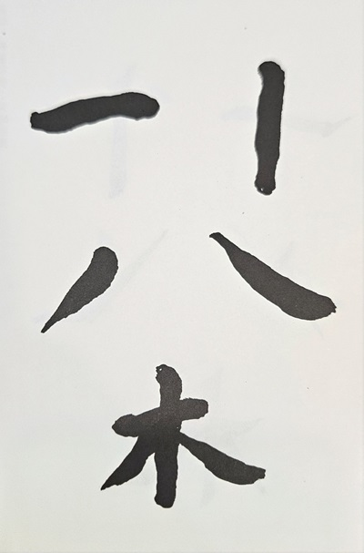

---
title: '佚名-張猛龍碑'
tags: ['碑刻', '楷書']
order: 6
---
# 佚名-張猛龍碑

## 特色:
* 方正雄強，結體穩重。
* 行筆遲澀而深沉，得舒緩、藏露對立統一之妙。
* 同樣的部首邊龍變化多端，和而不同。

## 書寫要領
* 可先從《龍門二十品》中擇優臨習魏碑的穩重行筆和結體，再來臨習此帖。
* 此碑石因日久剝飾，其筆劃線條較原本纖瘦，因此臨習時可令筆畫稍加粗壯。
* 四要
  * 含墨要飽，字才能夠豐腴厚重
  * 緊筆入紙，線質才能沈雄中實
  * 行筆稍慢，務求溺筆逆勢節前
  * 方中寓圓，起收筆和轉折處用方筆（側鋒），而運行時應用圓筆（中鋒），方圓不斷交替，關鋌在於手腕轉動靈活。
* 三忌
  * 忌側鋒偏鋒不分
  
    側鋒：執筆緊挺，筆鋒略斜而摩擦入紙運行，讓筆畫線條勁挺有力。      
    偏鋒：執筆髮懈，而令筆肚揩抹紙面運行，筆畫軟緩扁薄。          
    ::: warning 病筆示意-偏鋒扁軟
    
    :::
  * 忌方板平直
  
    寫魏碑者如果只用側鋒，而全無中鋒方圓之意，讓筆畫毫無起伏波折，而顯得平直板滯。    
    ::: warning 病筆示意-方板平直:
    
    :::
  * 忌太厲太鈍
    
    用筆如太厲太尖，字會顯得缺乏沈厚。
    ::: warning 病筆示意-尖峭刻厲:
    
    :::
    
    用筆圓鈍痴腫，字會顯得笨拙乏神。
    ::: warning 病筆示意-臃腫痴鈍:
    
    :::
